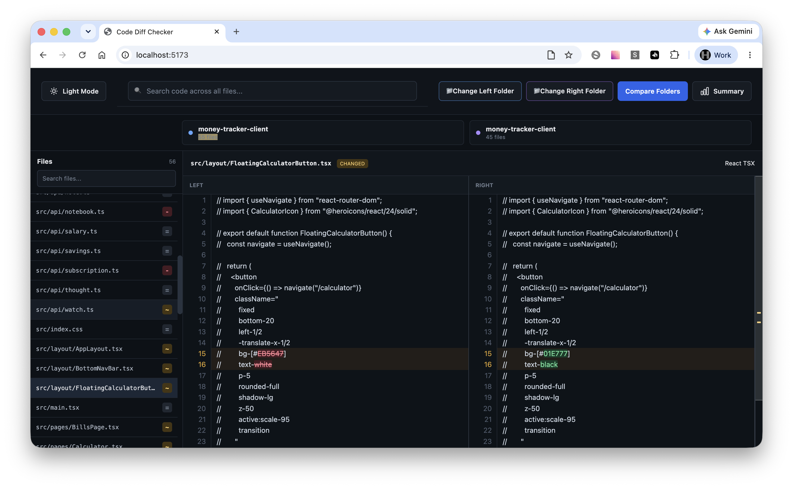

# Code Diff Checker

A lightweight **folder comparison and code diff tool** for quickly reviewing differences between two versions of a project.

Code Diff Checker lets you select two folders, compare their files, search across the results, and inspect changes side by side.

## Screenshot



## Features

- 📁 **Compare Two Folders**

  - Select a left and right folder as comparison sources.
  - Compare files across both folders.

- 🔍 **Search**

  - Search for files or specific changes within the comparison.

- 📝 **Side-by-Side Diff**

  - View the left and right versions of a file simultaneously.
  - Clearly identify added, removed, and changed content.

- 📋 **File Status**

  - Quickly identify files that are:

    - Added
    - Removed
    - Changed
    - Unchanged

- 🌙 **Dark Mode**

  - Toggle between light and dark mode for easier viewing.

- 📊 **Comparison Summary**

  - View an overview of the files found in each folder and their comparison status.

## How It Works

1. Select the **Left Folder**.
2. Select the **Right Folder**.
3. Click **Compare Folders**.
4. Review the list of files and their status.
5. Select a file to view its code differences side by side.
6. Use the search field to quickly find a specific file or change.

## Comparison

The tool compares two versions of a project and provides a visual representation of the differences.

For example:

```text
Left Folder                         Right Folder
──────────────────                  ──────────────────
15 files                            16 files

js/creative.js        CHANGED       js/creative.js
js/creativeTools.js   CHANGED       js/creativeTools.js
js/newFeature.js                    js/newFeature.js   ADDED
```

### File Status

| Status      | Description                                          |
| ----------- | ---------------------------------------------------- |
| `ADDED`     | File exists only in the right folder                 |
| `REMOVED`   | File exists only in the left folder                  |
| `CHANGED`   | File exists in both folders but contains differences |
| `UNCHANGED` | File exists in both folders with no differences      |

## Interface

The application provides:

- **Change Left Folder** — Select the source/original project.
- **Change Right Folder** — Select the updated project.
- **Compare Folders** — Run the folder comparison.
- **Search** — Find files or changes quickly.
- **Dark Mode** — Switch between light and dark themes.
- **File List** — Browse comparison results.
- **Diff Viewer** — Inspect the selected file side by side.

## Use Cases

Code Diff Checker is useful when:

- Comparing development and staging versions.
- Reviewing changes between two template versions.
- Checking HTML, CSS, JavaScript, or JSON files.
- Reviewing changes before committing to Git.
- Comparing exported project folders.
- Finding files that were added, removed, or modified.
- Troubleshooting unexpected changes between two builds.

## Supported Files

The tool is designed primarily for text-based files such as:

- JavaScript
- HTML
- CSS
- JSON
- TypeScript
- Markdown
- Configuration files
- Other text-based source files

## Example Workflow

```text
Original Project
       │
       ▼
Change Left Folder
       │
       │
       ├──────────────┐
       │              │
       ▼              ▼
   LEFT FOLDER    RIGHT FOLDER
       │              │
       └──────┬───────┘
              ▼
       Compare Folders
              │
              ▼
       Comparison Results
              │
              ▼
        Select a File
              │
              ▼
        Side-by-Side Diff
```

## Project Structure

```text
code-diff-checker/
├── src/
├── public/
├── package.json
└── README.md
```

> Update the project structure above based on the actual repository structure.

## Getting Started

Clone the repository:

```bash
git clone https://github.com/YOUR_USERNAME/code-diff-checker.git
cd code-diff-checker
```

Install dependencies:

```bash
npm install
```

Start the development server:

```bash
npm run dev
```

## Roadmap

- [ ] Add 'Show only with changes'
- [ ] Improved diff highlighting
- [ ] Syntax highlighting
- [ ] Ignore specific files or folders
- [ ] Ignore whitespace-only changes
- [ ] Export comparison results
- [ ] Download diff reports
- [ ] More detailed comparison statistics
- [ ] Drag-and-drop folder selection
- [ ] Git repository comparison support
